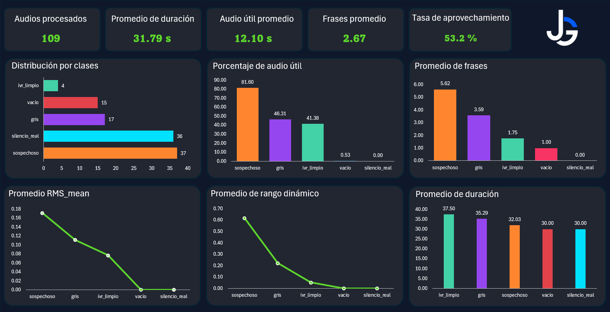
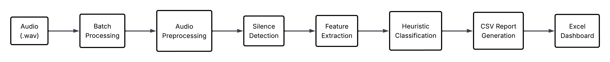
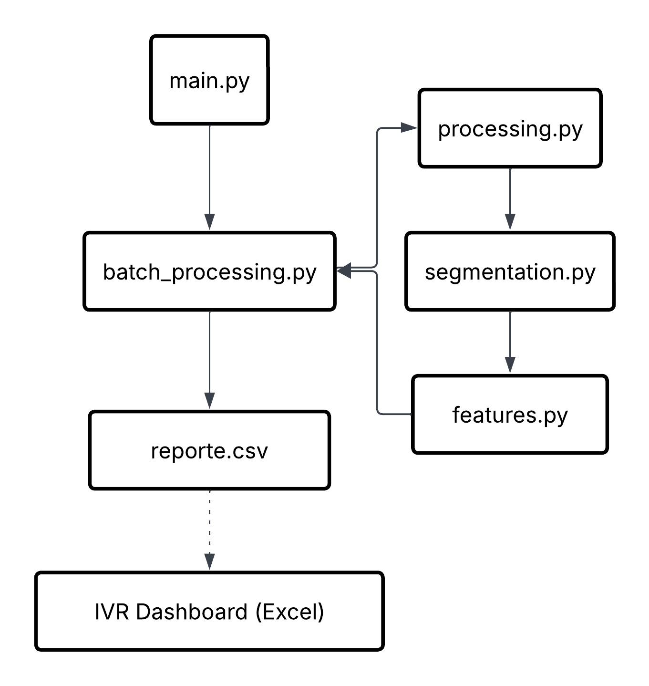

# IVR Audio Analysis Pipeline

Pipeline desarrollado en Python para el análisis automático de grabaciones telefónicas (IVR), enfocado en la evaluación de calidad de audio, detección de silencios y extracción de métricas operativas.

El sistema permite identificar grabaciones vacías, silencios prolongados y audios potencialmente problemáticos mediante técnicas de procesamiento digital de señales y análisis de características acústicas, ademas de generar reportes que faciliten el monitoreo operativo mediante un dashboard interactivo en Excel.
---

# Dashboard

El resultado final del proyecto es un dashboard que resume automáticamente los principales indicadores obtenidos durante el procesamiento de las grabaciones.

<p align="center">
    
</p>

---

# Caso de uso

En entornos donde se generan cientos de grabaciones IVR diariamente, la revisión manual de cada archivo resulta lenta, repetitiva y poco escalable.

Este proyecto automatiza dicho proceso mediante un pipeline de procesamiento de audio que analiza cada grabación, identifica posibles incidencias, extrae métricas relevantes y genera reportes estructurados para facilitar el monitoreo operativo y el análisis posterior mediante un dashboard en Excel.

---

# Descripción del problema

Los sistemas IVR generan grandes volúmenes de grabaciones telefónicas que con frecuencia contienen:

- Audios vacíos.
- Silencios prolongados.
- Grabaciones incompletas.
- Problemas de calidad.
- Contenido útil mezclado con largos periodos de silencio.

Detectar este tipo de incidencias de forma manual implica invertir tiempo y recursos, además de dificultar el monitoreo continuo de la operación.

Para resolver este problema, se desarrolló un pipeline modular capaz de procesar automáticamente múltiples grabaciones, extraer características acústicas, clasificarlas y generar reportes listos para su análisis.

---

# Flujo de procesamiento

El siguiente diagrama resume el funcionamiento general del sistema.

<p align="center">
    
</p>

---
# Arquitectura del procesamineto
El siguiente diagrama resume el funcionamiento general del procesamiento.

<p align="center">
    
</p>

---

# Estructura del proyecto

```text
ivr-audio-analysis/
│
├── data/
│   ├── raw/
│   └── processed/
│
├── pipeline/
│   └── batch_processing.py
│
├── src/
│   ├── processing.py
│   ├── segmentation.py
│   └── features.py
│
├── outputs/
│   └── reporte_audio.csv
│
├── dashboard/
│   └── ivr_dashboard.xlsx
│
├── images/
│   ├── dashboard.png
│   └── pipeline_workflow.png
│
├── main.py
├── requirements.txt
└── README.md
```

---

# Funcionalidades

- Procesamiento por lotes de múltiples archivos de audio.
- Detección automática de silencios.
- Segmentación de grabaciones.
- Extracción de características acústicas.
- Cálculo de energía RMS.
- Cálculo de rango dinámico.
- Clasificación heurística de las grabaciones.
- Generación automática de reportes en formato CSV.
- Integración de resultados en un dashboard para análisis exploratorio.

---

# Categorías de clasificación

Cada grabación es clasificada automáticamente en una de las siguientes categorías.

| Categoría | Descripción |
|-----------|-------------|
| **ivr_limpio** | Grabación con contenido útil y calidad adecuada. |
| **sospechoso** | Audio con posibles anomalías o comportamiento atípico. |
| **gris** | Casos intermedios que requieren revisión manual. |
| **vacio** | Grabación vacía o inválida. |
| **silencio_real** | Grabación compuesta principalmente por silencio. |

---

# Tecnologías utilizadas

- Python
- Pandas
- NumPy
- Librosa
- OpenPyXL
- Microsoft Excel
- Git

---

# Instalación

```bash
pip install -r requirements.txt
```

---

# Ejecución

```bash
python main.py
```

---

# Resultados obtenidos

El pipeline genera automáticamente:

- Reporte en formato CSV con una fila por cada grabación procesada.
- Clasificación automática de las grabaciones.
- Métricas de duración total.
- Porcentaje de audio útil.
- Estadísticas de energía RMS.
- Métricas de rango dinámico.
- Dashboard interactivo en Excel para facilitar el análisis de resultados.

Durante las pruebas realizadas se procesaron **109 grabaciones**, obteniendo reportes estructurados que permiten identificar rápidamente problemas de calidad sin necesidad de revisar manualmente cada archivo.

---

# Habilidades demostradas

Este proyecto demuestra experiencia práctica en:

- Desarrollo de aplicaciones con Python.
- Procesamiento Digital de Señales (DSP).
- Análisis y procesamiento de audio.
- Automatización de procesos.
- Procesamiento y análisis de datos con Pandas.
- Extracción de características acústicas.
- Generación automática de reportes.
- Desarrollo de dashboards en Microsoft Excel.
- Diseño modular de software.

---

# Conjunto de datos

Las grabaciones originales utilizadas durante el desarrollo del proyecto no se incluyen en este repositorio debido a restricciones de privacidad y tamaño.

Se proporcionan únicamente archivos de ejemplo para demostrar el funcionamiento general del pipeline.

---

# Autor

**Johnny M. Galicia O.**

Estudiante de Física — Universidad Nacional Autónoma de México (UNAM)

Python | Análisis de Datos | Procesamiento Digital de Señales